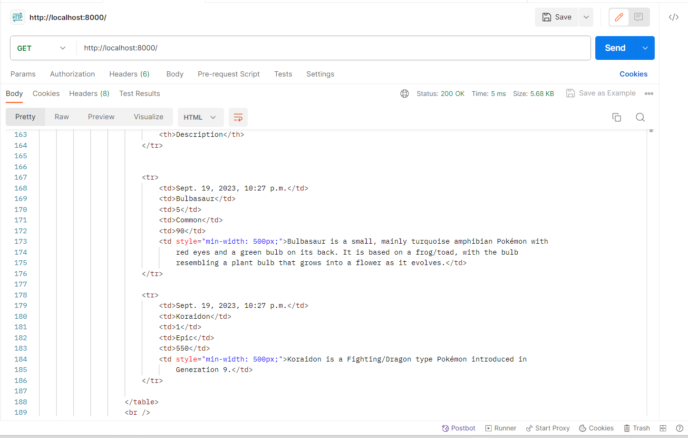

> Repositori tugas PBP
```credential
NAMA    : Fadhil Muhammad
NPM     : 2206083464
```

<details>
<summary style="color: white; font-size: 30px">Tugas 2</summary>

## Daftar Isi

- [Pengenalan](#pengenalan)
- [Langkah-Langkah Pengimplementasian](#langkah-langkah-pengimplementasian)
- [Diagram](#diagram)
- [Mengapa Menggunakan Virtual Environment?](#mengapa-menggunakan-virtual-environment)
- [Apa itu MVC, MVT, dan MVVM?](#apa-itu-mvc-mvt-dan-mvvm)

## Pengenalan
Tautan web: https://poke-co.adaptable.app/main

[Poké.co](https://poke-co.adaptable.app/main) merupakan website dengan tema utama pengumpulan atau pengoleksian karakter-karakter Pokémon yang dibangun menggunakan Django untuk tugas kali ini.

## Langkah-Langkah Pengimplementasian
Dalam proses pembuatan website ini, hal pertama yang dilakukan adalah membuat repositori baru di github sebagai tempat penyimpanan hasil pekerjaan.

Setelah itu, *step-step* yang dilakukan antara lain:

1. **Membuat Direktori Lokal Baru untuk Proyek Aplikasi**
 
    Langkah pertama adalah membuat direktori baru pada perangkat lokal sebagai direktori utama untuk pengerjaan proyek
2. **Mengaktifkan *Virtual Environment* pada Direktori**

    Setelah direktori pada langkah pertama berhasil dibuat, selanjutnya menginisialisasi atau mengaktifkan virtual environment untuk proyek.
    ```shell
    python -m venv env
    ```
    Menjalankan perintah di atas pada command prompt untuk menginisialisasi virtual environment pada folder proyek.
3. **Mengaktifkan *Virtual Environment***

    Mengaktifkan virtual environment untuk direktori proyek dengan menjalankan script berikut pada command prompt.
    ```
    env\Scripts\activate.bat
    ```
4. **Menginstall *Dependencies* atau *Requirements***

    Setelah virtual environment berhasil diaktifkan, membuat file baru pada direktori bernama `requirements.txt` dengan isi sebagai berikut:

    ```
    django
    gunicorn
    whitenoise
    psycopg2-binary
    requests
    urllib3
    ```

    Setelah file `requirements.txt` berhasil dibuat, lalu install requirements atau dependencies tersebut dengan menjalankan script berikut pada command prompt.

    ```shell
    pip install -r requirements.txt
    ``````
5. **Membuat Proyek Django**

    Setelah semua dependencies terinstall, inisialisasi atau mulai proyek baru dengan menjalankan perintah berikut:
    ```shell
    django-admin startproject poke_co .
    ```
6. **Konfigurasi Proyek**

    Setelah proyek berhasil dibuat, langkah selanjutnya adalah mengkonfigurasi proyek. Hal yang dilakukan pada langkah ini di antaranya:

    1. Menambahkan allowed host pada file `settings.py`
        ```python
        ...
        ALLOWED_HOSTS = ["*"]
        ...
        ``` 
    2. Menambahkan direktori staticfiles dan static root pada `settings.py` untuk file-file statis seperti *image*

        ```python
        ...
        STATICFILES_DIRS = (
            join(BASE_DIR, 'main/static'),
        )

        STATIC_ROOT = join(BASE_DIR, 'staticfiles')
        ...
        ```
    3. Mendaftarkan aplikasi `main` ke dalam proyek dengan menambahkan `"main"` ke dalam daftar aplikasi yang ada pada `settings.py`
        ```python
        INSTALLED_APPS = [
            ...,
            "main",
            ...
        ]
        ```
7. **Membuat *Template* untuk Laman *Website***

    Untuk menampilkan laman *page* yang diinginkan saat website dibuka, tambahkan sebuah folder baru pada direktori `main` bernama `templates`, lalu dalam folder `templates` tambahkan `main.html`. 

    Dalam `main.html`, isi file tersebut dengan HTML yang diinginkan. Dalam proyek ini, contoh dari bagianbody HTML yang digunakan untuk proyek ini adalah sebagai berikut:

    ```html
    ...
    <section>
        <h2>Player Information</h2>
        <h5>Name:</h5>
        <p>{{ name }}</p>
        <h5>Class:</h5>
        <p>{{ class }}</p>
    </section>
    ...
    ```
    Untuk selengkapnya dapat dilihat pada file `main.html`

8. **Konfigurasi untuk Gambar**

    Pada proyek ini, gambar digunakan untuk ditampilkan pada laman web. Agar gambar dapat ditampilkan pada saat *production* atau *deployment*:

    1. Buat folder tempat penyimpanan file statis (untuk gambar). Tempat penyimpanan disesuaikan dengan `path` pengambilan gambar yang ada pada template `main.html` dan konfigurasi yang ada pada `settings.py`

    2. Agar gambar dapat diambil pada saat `deployment`, jalankan perintah berikut.
        ```shell
        python manage.py collectstatic
        ```
        Akan terbentuk sebuah folder baru sebagai direktori file yang bisa diambil kontenya pada saat tahap *deployment*. Jika tidak menjalankan perintah tersebut, maka gambar kemungkinan tidak akan muncul pada saat *deployment* walaupun pada saat *development* secara lokal muncul.
    
    3. Tidak lupa, tambahkan `` pada `main.html` agar file statis dapat di-*load*.

9. **Mengimplementasikan Model**

    pada langkah ini, modifikasi file `models.py` sesuai dengan kriteria soal dan aplikasi yang akan dibuat. Untuk proyek ini, isi dari `models.py` adalah sebagai berikut:
    ```python
    from django.db import models

    class Item(models.Model):
        name = models.CharField(max_length=255, name="name")
        amount = models.IntegerField(name="amount")
        rarity = models.IntegerField(name="rarity", default=0)
        power = models.FloatField(name="power", default=0)
        description = models.TextField(name="description")
    ```

10. **Membuat dan Mengaplikasikan Migrasi Model**

    Lakukan migrasi model dengan menjalankan perintah berikut pada Command Prompt agar Django dapat melacak perubahan pada model *database*.
    ```shell
    python manage.py makemigrations
    python manage.py migrate
    ```

11. **Menghubungkan *View* dengan *Template***

    Menambahkan kode berikut pada `views.py`.
    ```python
    from django.shortcuts import render

    def show_main(request):
        context = {
            'name':'Fadhil Muhammad',
            'class':'PBP-B',
            'char_name':'Pikachu',
            'char_description':'This is Pikachu. You know this is Pikachu. Why are you asking me about why i wrote this?',
            'char_amount':'You have Gazillion amount of this character.'
        }

        return render(request, 'main.html', context)
    ```
    Karena proyek aplikasi ini belum sepenuhnya dikembangkan, beberapa *variable* masih digunakan hanya sebagai *place holder* sementara.

12. **Melakukan *Routing* URL**

    Agar aplikasi dapat dijalankan tambahkan kode berikut pada `urls.py` pada direktori proyek
    ```python
    from django.contrib import admin
    from django.urls import path, include
    from django.conf import settings
    from django.conf.urls.static import static

    urlpatterns = [
        path('main/', include('main.urls')),
        path('admin/', admin.site.urls),
    ]

    if settings.DEBUG:
        urlpatterns += static(settings.STATIC_URL, document_root=settings.STATIC_ROOT)
    ```

    dan kode berikut pada `urls.py` pada direktori `main`
    ```python
    from django.urls import path
    from main.views import show_main

    app_name = 'main'

    urlpatterns = [
        path('', show_main, name='show_main'),
    ] 
    ```

13. **Menambahkan *Unit Testing***

    Untuk menguji website, dilakukan beberapa *unit testing* dasar untuk menguji apakah website berhasil ter-*load* dengan baik atau tidak dengan menambahkan kode pada *tests.py* sesuai dengan pengujian yang ingin dilakukan. Untuk proyek ini:
    ```python
    from django.test import TestCase
    from django.test import Client

    class mainTest(TestCase):
        def test_main_url_is_exist(self):
            client = Client()
            response = client.get('/main/') 
            self.assertEqual(response.status_code, 200)

        def test_main_using_main_template(self):
            client = Client()
            response = client.get('/main/') 
            self.assertTemplateUsed(response, 'main.html')

        def test_template_rendering(self):
            client = Client()
            response = client.get('/main/')
            self.assertEqual(response.status_code, 200)

            # Cek konten template
            self.assertContains(response, "Welcome to Poké.co")
            self.assertContains(response, "Player Information")
            self.assertContains(response, "Featured Character")
            self.assertContains(response, "Name:")
            self.assertContains(response, "Class:")

            # Cek gambar
            self.assertInHTML("", response.content.decode())

            # Cek konten footer
            self.assertContains(response, "Fadhil Muhammad (2206083464). Pemrograman Berbasis Platform Gasal 23/24.")
    ```
    Lalu, jalankan *testing* tersebut dengan menjalankan perintah berikut
    ```shell
    python manage.py test
    ```
14. **Melakukan *Deployment***

    Setelah semua tahap selesai, *deploy* aplikasi ke [Adaptable](https://adaptable.io/).


## Diagram *Framework*


Django adalah sebuah framework web yang memungkinkan pengembang untuk dengan mudah membuat dan mengelola situs web yang responsif dan dinamis. Django berfungsi dengan cara berikut:

1. **Permintaan dari Client**: Ketika seorang pengguna membuka situs web di peramban (browser), peramban akan mengirimkan permintaan HTTP ke server Django.

2. ***Routing* dan *URL Pattern***: Django memiliki sistem routing yang akan memeriksa pola URL pada permintaan dari *client* untuk menentukan tindakan atau *view* apa yang harus diambil untuk menangani permintaan tersebut.

3. **Menghubungkan dengan views.py**: Setelah pola URL cocok dengan permintaan, Django akan memanggil fungsi yang sesuai dalam berkas views.py. Fungsi-fungsi ini berisi program-program untuk menangani permintaan tersebut.

4. **Interaksi dengan models.py**: Untuk mengambil atau memanipulasi data yang diperlukan, views.py akan berinteraksi dengan berkas models.py. Models digunakan untuk mendefinisikan struktur data dan hubungan antar data dalam aplikasi.

5. **Membangun Halaman Web (HTML)**: Setelah data yang diperlukan telah diambil dari models.py, views.py akan menggunakan template HTML yang ada dalam direktori templates untuk merender halaman web. Data yang telah diambil dapat dimasukkan ke dalam template untuk membuat halaman web yang dinamis.

6. **HTTP Response**: Terakhir, views.py akan mengembalikan hasilnya dalam bentuk respons HTTP. Respons ini berisi halaman web yang telah dibuat (dalam bentuk HTML) dan akan dikirimkan kembali kepada *client* yang mengirimkan permintaan awal.


## Mengapa Menggunakan *Virtual Environment*?
Ada beberapa alasan mengapa kita sangat disarankan atau diharuskan menggunakan virtual environment saat memulai proyek Django, di antaranya:
1. **Dependensi Tertutup**

    Virtual environment memungkinkan kita untuk membuat lingkungan Python yang terisolasi secara mandiri dari instalasi Python global di sistem. Ini berarti kita dapat memiliki versi Python dan paket dependensi yang berbeda untuk setiap proyek, tanpa khawatir konflik antara versi atau paket yang digunakan oleh proyek yang berbeda.

2. ***Cleanliness* dan Pengelolaan Dependensi**

    Dengan menggunakan virtual environment, kita dapat mengelola dependensi proyek kita dengan lebih mudah. Kita dapat menginstal modul-modul Python yang diperlukan secara terpisah untuk setiap proyek. Selain itu, kita dapat dengan mudah membuat daftar dependensi proyek (biasanya disimpan dalam berkas `requirements.txt`) untuk mengulangi pengaturan proyek di *environment* lain atau bagi orang lain yang ingin bekerja pada proyek tersebut.

3. **Keamanan**

    *Virtual environment* dapat membantu mencegah terjadinya masalah jika ada pembaruan atau perubahan yang perlu kita lakukan pada sebuah proyek, tanpa memengaruhi proyek lain yang menggunakan versi Python atau paket yang berbeda.

Pengerjaan proyek Django tanpa menggunakan *virtual environment* tetap dapat dilaksanakan. Meskipun demikian, poin-poin di atas menjelaskan mengapa *virtual environment* sangat penting digunakan.

## Apa itu MVC, MVT, dan MVVM?

MVC (Model-View-Controller), MVT (Model-View-Template), dan MVVM (Model-View-ViewModel) adalah tiga kerangka arsitektur yang umum digunakan dalam pengembangan perangkat lunak. Tujuan utamanya adalah membagi komponen-komponen inti dalam aplikasi dan mempermudah manajemen kode. Meskipun ketiganya memiliki kesamaan dalam pemisahan peran, terdapat perbedaan signifikan dalam bagaimana mereka mengatur dan berinteraksi antara satu sama lain.

MVC adalah pendekatan yang pertama kali muncul dalam pengembangan perangkat lunak. Dalam MVC, aplikasi dibagi menjadi tiga komponen utama: Model, View, dan Controller. Model bertanggung jawab atas manajemen data dan logika bisnis, View bertanggung jawab untuk menampilkan data kepada pengguna, sementara Controller bertindak sebagai perantara yang mengoordinasikan aliran data dan tindakan yang dilakukan pengguna.

MVT, atau Model-View-Template, adalah varian dari MVC yang sering digunakan dalam kerangka kerja web seperti Django. Dalam MVT, Model tetap mengelola data dan logika bisnis, sedangkan Template mengambil peran View dalam menampilkan data kepada pengguna. Controller pada dasarnya terintegrasi dalam kerangka kerja Django, sehingga pengembang tidak perlu membuatnya secara eksplisit.

Sementara itu, MVVM adalah arsitektur yang lebih modern, sering digunakan dalam pengembangan aplikasi berbasis antarmuka pengguna, seperti aplikasi seluler atau desktop. Dalam MVVM, Model tetap mengelola data dan logika bisnis, tetapi ada tambahan komponen yang disebut ViewModel. ViewModel bertindak sebagai perantara antara Model dan View, mengubah data Model agar sesuai dengan tampilan yang diinginkan oleh View, dan mengelola tindakan yang dilakukan oleh pengguna.

Perbedaan utama antara ketiga pendekatan ini terletak pada cara mereka mengatur peran dan tanggung jawab komponen-komponen utama dalam aplikasi. MVC dan MVT umumnya digunakan dalam konteks aplikasi web tradisional, sementara MVVM lebih sering diterapkan dalam aplikasi modern berbasis antarmuka pengguna. Semua arsitektur ini bertujuan untuk memudahkan pemeliharaan kode, meningkatkan skalabilitas, dan memahami konsep dalam pengembangan perangkat lunak, dengan pilihan tergantung pada jenis aplikasi yang dikembangkan dan preferensi pengembangnya.

</details>

<details>
<summary style="color: white; font-size: 30px">Tugas 3</summary>

## Daftar Isi
- [Langkah-Langkah Pengimplementasian](#langkah-langkah-pengimplementasian-1)
- [Apa perbedaan antara form POST dan form GET dalam Django?](#apa-perbedaan-antara-form-POST-dan-form-GET=dalam-Django?)
- [Apa perbedaan utama antara XML, JSON, dan HTML dalam konteks pengiriman data?](#apa-perbedaan-utama-antara-xml-json-dan-html-dalam-konteks-pengiriman-data)
- [Mengapa JSON sering digunakan dalam pertukaran data antara aplikasi web modern?](#mengapa-json-sering-digunakan-dalam-pertukaran-data-antara-aplikasi-web-modern)
- [Postman](#postman)

## Langkah-Langkah Pengimplementasian
### Membuat `forms.py`
File `forms.py` dalam proyek Django digunakan untuk mendefinisikan formulir yang akan digunakan dalam aplikasi web. Formulir dapat dihubungkan dengan model Django untuk membuat, mengubah, atau menghapus objek model berdasarkan input dari pengguna. 

Isi `forms.py`:
```python
from django.forms import ModelForm
from main.models import Item

class ProductForm(ModelForm):
    class Meta:
        model = Item
        fields = ["name", "amount", "rarity", "power", "description"]
```

### Mengubah Isi File `views.py`
Untuk menampilkan jumlah item yang ada pada models, tambahkan kode pada `views.py`agar jumlah item pada models dapat diakses.

*Update* fungsi `show_main()` menjadi:
```python
def show_main(request):
    total_characters = Item.objects.count() or 0
    total_pokemon = Item.objects.aggregate(total_amount=Sum('amount'))['total_amount'] or 0
    items = Item.objects.all()
    context = {
        'name':'Fadhil Muhammad',
        'class':'PBP-B',
        'char_name':'Pikachu',
        'char_description':'Pikachu, the most popular character.',
        'char_rarity':'Rare',
        'total_characters':total_characters,
        'total_pokemon':total_pokemon,
        'items':items
    }

    return render(request, 'main.html', context)
```

### Membuat HTML untuk Form

Menambahkan `create_item.html` untuk tampilan form yang akan ditampilkan kepada user saat diakses. Untuk ini, django telah menyediakan opsi yang memudahkan kita dalam pembuatan laman formulir.

Isi `create_item.html`:
```html


<h1>Add New Character to Your List</h1>

<form method="POST">
    
    <table>
        {{ form.as_table }}
        <tr>
            <td></td>
            <td>
                <input type="submit" value="Add Character"/>
            </td>
        </tr>
    </table>
</form>



```

### Menambahkan `templates\base.html`
Buat folder baru pada root directory bernama `templates` dan tambahkan file `base.html` di dalamnya. 

Isi dari `base.html`:
```html

<!DOCTYPE html>
<html lang="en">
    <head>
        <meta charset="UTF-8" />
        <meta
            name="viewport"
            content="width=device-width, initial-scale=1.0"
        />
        
        
    </head>

    <body>
        
        
    </body>
</html>
```
### Meng-*update* `main.html` pada Direktori `main\templates\`
Untuk menampilkan data yang telah disubmit pada form, perlu dilakukan penambahan pada `main.html`. 

Kode yang ditambahkan:
```html
...
    ...
        <section>
            <h2>Your Collections</h2>
            <p>You currently own a total of {{total_characters}} characters and a total of {{total_pokemon}} Pokémons</p>

            <div style="overflow-y: auto;">
                <table>
                    <tr>
                        <th>Timestamp (UTC+7)</th>
                        <th>Name</th>
                        <th>Amount</th>
                        <th>Rarity</th>
                        <th>Power</th>
                        <th>Description</th>
                    </tr>
                
                    
                    <tr>
                        <td>{{item.date_added}}</td>
                        <td>{{item.name}}</td>
                        <td>{{item.amount}}</td>
                        <td>{{item.rarity}}</td>
                        <td>{{item.power}}</td>
                        <td style="min-width: 500px;">{{item.description}}</td>
                    </tr>
                    
                </table>
                <br />
            </div>
        
            <a href="">
                <button>
                    Add New Character
                </button>
            </a>
        </section>
    ...
...
```
### Menambahkan View untuk XML dan JSON Serializer
Untuk melihat data-data yang disimpan dalam bentuk XML atau JSOn, digunakan serializer. Untuk melihat hasil serializer dari XML atau JSON, tambahkan dua fungsi berikut pada `views.py`:
```python
def show_xml(request):
    data = Item.objects.all()
    return HttpResponse(serializers.serialize("xml", data), content_type="application/xml")

def show_json(request):
    data = Item.objects.all()
    return HttpResponse(serializers.serialize("json", data), content_type="application/json")
```
dan tambahkan path berikut pada `urls.py` direktori aplikasi:
```python
...
urlpatterns = [
    ...
    path('xml/', show_xml, name='show_xml'),
    path('json/', show_json, name='show_json'),
    ...
]
...
```
Untuk menampilkan views dari `id` masing-masing data, tambahkan fungsi berikut pada `views.py`:
```python
def show_xml_by_id(request, id):
    data = Item.objects.filter(pk=id)
    return HttpResponse(serializers.serialize("xml", data), content_type="application/xml")

def show_json_by_id(request, id):
    data = Item.objects.filter(pk=id)
    return HttpResponse(serializers.serialize("json", data), content_type="application/json")
```
dan path berikut pada `urls.py` aplikasi:
```python
...
urlpatterns = [
    ...
    path('xml/<int:id>/', show_xml_by_id, name='show_xml_by_id'),
    path('json/<int:id>/', show_json_by_id, name='show_json_by_id') 
]
...
```


## Apa perbedaan antara form POST dan form GET dalam Django?
Dalam Django, form POST dan form GET memiliki beberapa perbedaan utama:

1. **Form POST**: Form POST dalam Django dikembalikan menggunakan metode POST, di mana browser mengumpulkan data formulir, meng-*encode*-nya untuk transmisi, mengirimkannya ke server, dan kemudian menerima kembali responsnya1. Metode POST akan mengirimkan data atau nilai langsung ke file lain2. Pemakaian metode POST ini digunakan untuk mengirimkan data yang penting / kredensial dan data yang orang lain tidak boleh tau / *secret data*, seperti password, dan sebagainya2.

2. **Form GET**: Sebaliknya, GET mengumpulkan data yang dikirimkan menjadi sebuah string, dan menggunakan ini untuk menyusun URL1. Metode GET akan menampilkan data/nilai pada URL, kemudian akan ditampung oleh action3.

Secara umum, metode POST digunakan saat kita ingin mengirimkan data yang tidak boleh dilihat oleh pengguna lain (misalnya password), sedangkan metode GET digunakan saat kita ingin pengguna dapat melihat data yang dikirimkan (misalnya dalam pencarian).

referensi: [Django - Working with forms](https://docs.djangoproject.com/en/4.2/topics/forms/)

### Apa perbedaan utama antara XML, JSON, dan HTML dalam konteks pengiriman data?
XML, JSON, dan HTML adalah tiga format yang sering digunakan dalam pengiriman data di web. Berikut adalah perbedaan utama antara ketiganya:

1. XML (eXtensible Markup Language):

    - XML adalah bahasa markup yang menyediakan aturan untuk menentukan data apa pun.
    - XML menggunakan tkita untuk membedakan antara atribut data dan data aktual.
    - XML merepresentasikan data dalam pola struktur *tree*.
    - XML memisahkan data dari HTML.
    - XML menyederhanakan proses perubahan platform.

2. JSON (JavaScript Object Notation):
    - JSON adalah format pertukaran data terbuka yang dapat dibaca baik oleh manusia maupun mesin
    - JSON bersifat independen dari setiap bahasa pemrograman dan merupakan output API umum dalam berbagai aplikasi
    - JSON menggunakan pasangan key-value untuk merepresentasikan data
    - JSON mendukung dan didukung semua browser.

3. HTML (HyperText Markup Language):

    - HTML adalah bahasa markup stkitar untuk dokumen yang dirancang untuk ditampilkan di browser web.
    HTML tidak dirancang sebagai format pertukaran data, tetapi sebagai format untuk menampilkan data, dengan fokus pada bagaimana data tampak bagi pengguna akhir.
    - HTML menggunakan tag yang dikelilingi oleh tkita kurung sudut (< dan >) untuk membuat elemen.

### Mengapa JSON sering digunakan dalam pertukaran data antara aplikasi web modern?

Dalam konteks pengiriman data, baik XML dan JSON digunakan secara luas. Namun, JSON dianggap lebih efisien karena data direpresentasikan sebagai objek JavaScript, dan dengan demikian beberapa bit dilewatkan melalui kabel. Lebih sedikit waktu mesin diperlukan untuk pemrosesan data.

Singkatnya, JSON adalah format pertukaran data yang lebih baik, sedangkan XML adalah format pertukaran dokumen yang lebih baik. HTML biasanya tidak digunakan untuk pertukaran data, tetapi lebih fokus pada menampilkan data ke pengguna.

### Postman

HTML



XML


JSON


XML by ID


JSON by ID

</details>


<details>
<summary style="color: white; font-size: 30px">Tugas 4</summary>

# Cara Implementasi
### Membuat Template Registrasi User
Membuat file `register.html` yang ada pada direktori `main\templates\` untuk menampilkan page ketika user melakukan registrasi akun.
```html



    <title>Register</title>


  

<div class = "login">
    
    <h1>Register</h1>  

        <form method="POST" >  
              
            <table>  
                {{ form.as_table }}  
                <tr>  
                    <td></td>
                    <td><input type="submit" name="submit" value="Daftar"/></td>  
                </tr>  
            </table>  
        </form>

      
        <ul>   
              
                <li>{{ message }}</li>  
                  
        </ul>   
    

</div>  


```

### Membuat Fungsi Registrasi
Menambahkan fungsi registrasi agar user baru bisa menambahkan akunnya. Menambahkan fungsi berikut ini pada `main\views.py`:

```python
def register(request):
    form = UserCreationForm()

    if request.method == "POST":
        form = UserCreationForm(request.POST)
        if form.is_valid():
            form.save()
            messages.success(request, 'Your account has been successfully created!')
            return redirect('main:login')
    context = {'form':form}
    return render(request, 'register.html', context)
```

### Membuat Template Login User
Menambahkan `login.html` pada direktori `main\templates` untuk template yang akan digunakan user saat proses login.
```html



    <title>Login</title>




<div class = "login">

    <h1>Login</h1>

    <form method="POST" action="">
        
        <table>
            <tr>
                <td>Username: </td>
                <td><input type="text" name="username" placeholder="Username" class="form-control"></td>
            </tr>
                    
            <tr>
                <td>Password: </td>
                <td><input type="password" name="password" placeholder="Password" class="form-control"></td>
            </tr>

            <tr>
                <td></td>
                <td><input class="btn login_btn" type="submit" value="Login"></td>
            </tr>
        </table>
    </form>

    
        <ul>
            
                <li>{{ message }}</li>
            
        </ul>
         
        
    Don't have an account yet? <a href="">Register Now</a>

</div>


```

### Menambahkan Fungsi Login User
Menambahkan fungsi berikut pada `views.py` agar data yang ditampilkan adalah data milik user yang berhasil login.
```python
def login_user(request):
    if request.method == 'POST':
        username = request.POST.get('username')
        password = request.POST.get('password')
        user = authenticate(request, username=username, password=password)
        if user is not None:
            login(request, user)
            response = HttpResponseRedirect(reverse("main:show_main"))
            response.set_cookie('last_login', str(datetime.datetime.now()))
            return response
        else:
            messages.info(request, 'Sorry, incorrect username or password. Please try again.')
    context = {}
    return render(request, 'login.html', context)
```
### Menambahkan Fitur Last Login
Untuk menunjukkan kapan user terakhir login, tambahkan potongan kode berikut pada `main\templates\main.html`.
```html
...
    <h5>Last Login:</h5>
    <p>{{ last_login }}</p>
...
```

### Mengkonfigurasi Fungsi `show_main`
Untuk menampilkan item-item yang sesuai dan meminta login user, ubah isi fungsi `show_main` pada `views.py` dengan kode berikut.

```python
@login_required(login_url='/login')
def show_main(request):
    total_characters = Item.objects.filter(user=request.user).count() or 0
    total_pokemon = Item.objects.filter(user=request.user).aggregate(total_amount=Sum('amount'))['total_amount'] or 0
    items = Item.objects.filter(user=request.user)
    context = {
        'name':request.user.username,
        'class':'PBP-B',
        'char_name':'Pikachu',
        'char_description':'Pikachu, the most popular character.',
        'char_rarity':'Rare',
        'total_characters':total_characters,
        'total_pokemon':total_pokemon,
        'items':items,
        'last_login':request.COOKIES['last_login']
    }

    return render(request, 'main.html', context)
```
### Menambahkan Tombol dan Fungsi Logout
Agar user yang berhasil login dapat keluar, tambahkan *button* logout dengan menambahkan potongan kode berikut di `main.html` pada direktori `main\templates`:
```html
    ...
        ...
            <a href="">
                <button>
                    Logout
                </button>
            </a>
        ...
    ...
```

Setelah itu, tambahkan fungsi logout pada `views.py`:
```python
def logout_user(request):
    logout(request)
    response = HttpResponseRedirect(reverse('main:login'))
    response.delete_cookie('last_login')
    return response
```
## Implementasi Bonus
Menambahkan potongan kode berikut pada `main.html` yang ada pada direktori `main\templates` untuk menambahkan tombol menambah dan mengurangi jumlah item serta menghapus item.

```html
...
        <a href="#item-table">
            <button>delete</button>
        </a>
    ....
        <a href="#item-{{item.id}}">
            <button>-</button>
        </a>
    ....
        <a href="#item-{{item.id}}">
            <button>+</button>
        </a>
```
Setelah itu tambahkan fungsi `delete_item`, `subtract_item`, dan `add_item` pada `views.py`.
```python
def delete_item(request, item_id):
    item = Item.objects.get(pk=item_id)
    item.delete()
    return redirect('main:show_main')

def add_item(request, item_id):
    item = Item.objects.get(pk=item_id)
    item.amount += 1
    item.save()
    return redirect('main:show_main')

def subtract_item(request, item_id):
    item = Item.objects.get(pk=item_id)
    item.amount = max(0, item.amount - 1)
    item.save()
    return redirect('main:show_main')
```

# Pertanyaan
### Apa itu Django UserCreationForm, dan jelaskan apa kelebihan dan kekurangannya?
`UserCreationForm` adalah salah satu dari built-in forms yang disediakan oleh Django untuk mengelola proses otentikasi pengguna. Form ini dirancang khusus untuk membuat pengguna baru (user registration). Dengan menggunakan `UserCreationForm`, kita dapat dengan mudah membuat halaman pendaftaran pengguna dalam aplikasi Django. Form ini secara otomatis meng-handle validasi, penyimpanan data pengguna, dan proses pembuatan akun. Kelebihan dari `UserCreationForm` adalah menyediakan proses pembuatan akun yang terstkitardisasi dan sesuai dengan praktik keamanan yang baik. Kelemahannya adalah kemungkinan perlu disesuaikan untuk memenuhi kebutuhan khusus aplikasi.

### Apa perbedaan antara autentikasi dan otorisasi dalam konteks Django, dan mengapa keduanya penting?
1. Autentikasi adalah proses verifikasi identitas pengguna, yaitu memastikan bahwa pengguna adalah benar-benar pemilik akunnya. Dalam konteks Django, hal ini berarti memeriksa apakah pengguna memiliki akun yang valid dan telah memasukkan kredensial yang benar (seperti username dan password).


2. Otorisasi adalah proses menentukan akses apa yang diberikan kepada pengguna setelah pengguna berhasil diotentikasi. Hal Ini melibatkan kontrol terhadap hak akses pengguna terhadap sumber daya atau tindakan tertentu dalam aplikasi, seperti apakah pengguna memiliki izin untuk melihat halaman tertentu atau melakukan tindakan tertentu.

### Apa itu *cookies* dalam konteks aplikasi web, dan bagaimana Django menggunakan *cookies* untuk mengelola data sesi pengguna?
Cookies adalah data kecil yang disimpan oleh browser web pada komputer user. Cookies digunakan oleh situs web untuk menyimpan informasi tertentu pada laman web user, yang kemudian dapat digunakan untuk mengenali user ketika mereka kembali ke situs tersebut. Dalam konteks aplikasi web, cookies sering digunakan untuk mengelola sesi user, menyimpan preferensi, data, atau melacak perilaku user.

Django menggunakan cookies untuk mengelola data sesi pengguna. Ini berarti Django dapat menyimpan informasi sesi, seperti data login atau preferensi pengguna, di dalam cookies. Hal ini memungkinkan pengguna untuk tetap terotentikasi di seluruh sesi tanpa harus terus-menerus melakukan login kembali.

### Apakah penggunaan cookies aman secara default dalam pengembangan web, atau apakah ada risiko potensial yang harus diwaspadai?
Penggunaan cookies dalam pengembangan web akan aman jika diterapkan dengan benar. Namun, ada beberapa risiko potensial yang perlu diwaspadai, termasuk:

1. Cross-Site Scripting (XSS): Serangan yang memungkinkan penyerang menyisipkan kode skrip berbahaya ke dalam cookies pengguna.
2. Cross-Site Request Forgery (CSRF): Serangan yang memungkinkan penyerang menjalankan tindakan tertentu atas nama pengguna tanpa persetujuan mereka.
3. Session Hijacking: Potensi pencurian cookies sesi yang dapat digunakan oleh penyerang untuk mengakses akun pengguna.

Cookies dapat dengan mudah diakses oleh pengguna melalui web, sehingga tidak cocok untuk menyimpan informasi yang sensitif. 
</details>

<details>
<summary style="color: white; font-size: 30px">Tugas 5</summary>

# Desain Web dengan CSS

## Cara Implementasi

Pada tugas ini, saya membuat desain web dengan menggunakan CSS untuk mempercantik tampilan laman web yang sudah saya buat sebelumnya.

Saya membuat file CSS untuk setiap laman web yang saya buat. File CSS berisi aturan-aturan untuk mengatur gaya tampilan elemen-elemen HTML yang ada pada laman web. Saya menambahkan atribut class atau id pada tag HTML yang ingin saya beri gaya. Kemudian, saya menggunakan selector yang sesuai untuk menentukan elemen mana yang akan diberi gaya pada file CSS.

## File CSS

Berikut adalah file CSS yang saya buat untuk setiap laman web:

- [create_item.css](main\static\main\css\item.css): File ini berisi gaya untuk laman web yang digunakan untuk membuat item baru. Saya mengatur warna latar belakang, font, margin, padding, border, dan lain-lain untuk elemen-elemen seperti form, input, button, dan label.
- [login.css](main\static\main\css\login.css): File ini berisi gaya untuk laman web yang digunakan untuk login. Saya mengatur warna latar belakang, font, margin, padding, border, dan lain-lain untuk elemen-elemen seperti form, input, button, dan label.
- [main.css](main\static\main\css\main.css): File ini berisi gaya untuk laman web utama yang menampilkan daftar item yang tersedia. Saya mengatur warna latar belakang, font, margin, padding, border, dan lain-lain untuk elemen-elemen seperti div, h1, h2, ul, li, a, dan img.
- [register.css](main\static\main\css\register.css): File ini berisi gaya untuk laman web yang digunakan untuk registrasi. Saya mengatur warna latar belakang, font, margin, padding, border, dan lain-lain untuk elemen-elemen seperti form, input, button, dan label.

Saya juga menambahkan beberapa gambar dari internet untuk membuat laman web menjadi lebih menarik.

## Jelaskan manfaat dari setiap element selector dan kapan waktu yang tepat untuk menggunakannya.
Dalam CSS, ada tiga jenis selector utama: **element selector**, **class selector**, dan **id selector**. 

1. **Element Selector**: Selector ini digunakan untuk memilih elemen HTML berdasarkan nama elemennya. Misalnya, jika ingin menerapkan gaya yang sama ke semua elemen `<p>` di halaman web, kita dapat menggunakan element selector. Manfaatnya adalah dapat mengubah gaya semua elemen dengan jenis tertentu sekaligus.

2. **Class Selector**: Selector ini digunakan untuk memilih elemen berdasarkan class-nya. Class selector sangat berguna ketika kita ingin menerapkan gaya yang sama ke sekelompok elemen tanpa memkitang jenis elemennya. kita dapat menggunakan class selector ketika kita memiliki beberapa elemen yang ingin diberi gaya yang sama.

3. **ID Selector**: Selector ini digunakan untuk memilih satu elemen unik berdasarkan id-nya. ID selector biasanya digunakan ketika kita ingin menerapkan gaya khusus ke satu elemen saja di halaman web kita. Perlu diingat bahwa setiap id harus unik dan hanya dapat digunakan sekali dalam satu halaman.

Pemilihan selector yang tepat tergantung pada kebutuhan dan struktur halaman web kita. Jika kita ingin menerapkan gaya yang sama ke banyak elemen, gunakan class selector. Jika kita ingin menerapkan gaya khusus ke satu elemen saja, gunakan id selector. Dan jika kita ingin mengubah gaya semua elemen dengan jenis tertentu, gunakan element selector.


## Jelaskan HTML5 Tag yang kamu ketahui.

HTML5 memperkenalkan sejumlah tag baru yang memberikan lebih banyak fleksibilitas dan interaktivitas dalam mendesain halaman web. Berikut adalah beberapa tag HTML5 yang saya ketahui:

1. **`<!DOCTYPE html>`**: Tag ini digunakan untuk mendeklarasikan tipe dokumen dan versi HTML, dalam hal ini HTML5.

2. **`<header>`**: Tag ini digunakan untuk merangkum konten pengantar atau navigasi. Biasanya berisi judul situs, logo, dan menu navigasi.

3. **`<nav>`**: Tag ini digunakan untuk merangkum bagian navigasi situs web, biasanya berisi daftar tautan menu.

4. **`<main>`**: Tag ini digunakan untuk konten utama dari halaman web yang unik dan tidak termasuk dalam konten yang diulang di seluruh situs web seperti header, footer, atau navigasi.

5. **`<article>`**: Tag ini digunakan untuk merangkum konten mandiri yang dapat dipahami secara independen dari konten lainnya, seperti postingan blog atau berita.

6. **`<section>`**: Tag ini digunakan untuk mengelompokkan konten terkait dalam suatu bagian dokumen.

7. **`<aside>`**: Tag ini digunakan untuk konten yang sedikit terkait dengan konten utama sekitarnya, seperti sidebar atau iklan.

8. **`<footer>`**: Tag ini digunakan untuk merangkum informasi penutup seperti informasi hak cipta, tautan ke kebijakan privasi, dll.

9. **`<figure>` dan `<figcaption>`**: Tag ini digunakan untuk merangkum gambar, diagram, foto, kode, dll., dan judul atau keterangan yang terkait.

10. **`<video>`, `<audio>`, dan `<source>`**: Tag ini digunakan untuk menyematkan media seperti video dan audio ke dalam halaman web.

11. **``**: Tag ini digunakan untuk menyematkan gambar ke dalam halaman web.

12. **`<div>`**: Tag ini umumnya digunakan sebagai container.

## Jelaskan perbedaan antara margin dan padding.

Margin dan padding adalah dua properti dalam CSS yang digunakan untuk mengendalikan ruang di sekitar elemen. Berikut adalah perbedaan antara keduanya:

- **Margin**: Merupakan ruang di luar batas elemen. Margin tidak mempengaruhi ukuran elemen itu sendiri, tetapi menciptakan ruang ekstra di sekitarnya. Margin sering digunakan untuk membuat ruang antara elemen yang berbeda atau antara elemen dengan tepi browser.

- **Padding**: Merupakan ruang di dalam batas elemen, antara batas dan konten elemen itu sendiri. Padding mempengaruhi ukuran elemen dan sering digunakan untuk memberikan ruang ekstra di dalam elemen, seperti membuat teks tidak menempel langsung ke batas elemen.

Margin dan padding tidak mempengaruhi ukuran konten elemen itu sendiri, hanya ruang di sekitar kontennya. Juga, keduanya transparan, jadi warna latar belakang elemen atau halaman akan terlihat.

## Jelaskan perbedaan antara framework CSS Tailwind dan Bootstrap. Kapan sebaiknya kita menggunakan Bootstrap daripada Tailwind, dan sebaliknya?

Bootstrap memberikan komponen-komponen yang siap digunakan tanpa perlu kita ubah sedangkan tailwind memberikan template-template yang lebih sederhana yang harus kita kustomisasi terlebih dahulu sebelum digunakan. Jadi perbedaannya adalah tailwind lebih fleksibel dalam hal kustomisasi namun kurang cepat dalam hal implementasi sedangkan bootstrap lebih cepat dalam hal implementasi namun kurang fleksibel dalam hal kustomisasi.

Kita bisa menggunakan tailwind ketika kita harus membuat website dengan desain yang rumit dengan waktu yang cukup panjang. Sedangkan kita bisa menggunakan bootstrap ketika kita harus membuat website dengan desain yang sederhana dengan waktu yang singkat.
</details>